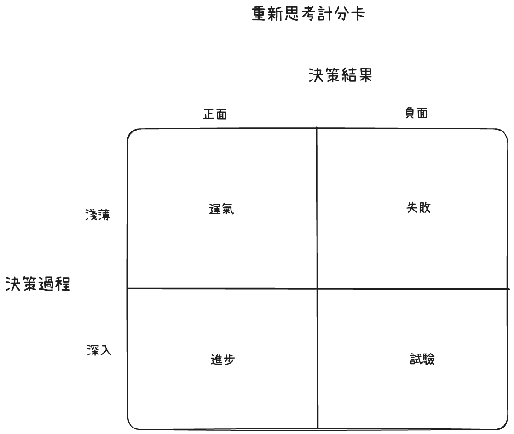

# 找出思考盲點、學會重新思考

我們時常用頑固、執迷不悟來形容思考僵化的人，甚至會引用「溫水煮青蛙」的例子來嘲諷耽溺於盲點的狀況。

但你知道嗎？其實「溫水煮青蛙」是以訛傳訛的謬論，結果不懂得重新思考的人，反而是我們自己。

## 為何讀這本書

> 在動盪不安的世界裡，更重要的或許是另一組認知技能：再思考及反學習的能力。

我的數學成績從小就和一灘死水沒兩樣，所以一直都很崇拜數理或分析能力卓越的人，也認為他們提出的論點都是公正、客觀的。然而亞當 . 格蘭特在《逆思維》馬上就點出這個認知的盲點：**若數據分析主題和我們的意識形態相佐，智力或數學能力反而會限制思考。**

就算是絕頂聰明的人，一樣逃不過期許偏誤和認知偏誤的束縛。

重新思考知易行難，因為那等於重新考慮我們深信不疑的事情，會威脅到我們的認同，甚至讓我們感覺到失去了一部分的自己，這便成為了大家可能都沒有察覺的「認知惰性」。

想想我們在開車時，都學過要借助後照鏡和感測器等等工具來注意盲點，然而我們的心智並沒有那些工具協助，所以我們更需要學會辨識認知盲點、修正思考。

> 如果知識是力量，知道我們不知道什麼則是智慧。

接下來我想列出讀完這本書後，讓我印象深刻並且刺激我「重新思考」的部分。

哥布林同胞們，不要放棄重新思考呀！

---

## 科學家不只是職業，更是一種心境

就和動畫《腦筋急轉彎》一樣，我們大腦也住著三種角色：

- 傳教士 - 積極擁護我們的信念，並無所不用其極和他人傳教。

- 檢察官 - 只要對方稍微質疑我們的信念，我們就會從對方言詞找出破綻加以控訴。

- 政治家 - 努力迎合他人以獲取利益，並積極打壓政敵。

這三種角色會輪流操控我們的大腦，不斷加深我們自以為正確，甚至神聖的信念，不利於敞開心胸接受不同意見、重新思考。

有鑑於此，作者建議我們邀請第四位角色進入我們的大腦：科學家。

科學家事事求事，讓數據和真相說話，但也勇於承認自己的不足，歡迎他人挑戰觀點。我們應該秉持科學家的好奇心，在急著自我維護和控訴對方之前，進行實驗來測試假設並挖掘新知識。

亞當 . 格蘭特所提出的科學家思維，打破了我從前以為科學家對完美的堅持。

他甚至分享了一個讓我印象深刻的故事：某位科學家本來已經準備好在發表會展示他所發現的新星體，結果上台前才發現自己犯了基礎的計算錯誤，那個星體根本就不存在。科學家沒有自圓其說，反而一上台就果斷坦承錯誤，結果竟然獲得同儕們起立鼓掌。

展現弱點本就不易，當你又秉持一定份量的專業和名聲更屬難得。我們多數人不會成為職業定義的科學家，但借鏡科學家思維能夠提升思考品質。

---

## 保持謙遜的自信

> 自負令我們對自己的缺點視而不見。謙遜是反射鏡片，幫助我們把缺點看得更清楚。自信的謙遜則是矯正鏡片，讓我們能克服那些缺點。

謙遜的自信看似矛盾，其實是信心和能力之間的甜蜜點。

缺乏自信一直都是我被詬病的毛病，但在某些應該保留的場合，又容易展現出過度的信心。

這便是著名的「達克效應」，當我們缺乏能力時，反而最有可能呈現過度自信，因為那時我們缺乏知識及能力去判斷何為優秀，所以容易將經驗 (其實也才累積一些) 和能力混為一談。有個好笑的詞形容這種狀況：愚蠢山巔。

另外也不是每個人都能和前面提到的科學家一樣，在眾目睽睽之下坦承弱點。大家都希望展現出自己最好的一面，當然這本身問題不大，但如果長時間不斷自我催眠，這些本該被消除的盲點就容易演化成根深蒂固的信念。

信心代表我們有多相信自己的程度，但不等於我們無時無刻都要是正確的。

我們必定會遭遇失敗或挑戰，那可能是做事方式、思考工具出了問題，只要換個方向嘗試就能找出解方。保持對自己能夠克服難關的信心，但要時時刻刻檢驗流程和工具，我想這就是作者想傳遞「保持謙遜的自信」。

---

## 任務型衝突反倒有利於重新思考

> 缺乏衝突不等於和諧，而是漠不關心。沉默是不尊重你觀點的價值，還有你進行一場文明爭執的能力。

害怕衝突也是我時常被詬病的一點 (結果看這本書感覺一直中槍)。雖然我們時常將和諧兩個字掛在嘴邊，但重新思考其實需要支持以外的網絡類型：異議網絡。也就是一群會指出我們盲點，並協助我們克服弱點的人。

團隊或群體若提倡適度的任務型衝突，更能激發出創意，避免落入窠臼。但作者也提醒，小心別將任務型衝突上綱成人際衝突。那怎麼樣才不會觸犯到那條紅線呢？作者分享了兩個重點：

1. **以討論為出發點**：提出異議時，以「我們可以討論嗎？」當作開場，將我們的大腦切換成科學家模式，並鼓勵對方也以那樣的方式一起思考。

2. **爭論要拒接在「如何」**：人際衝突爆發很常源於我們對自己的立場產生情感依附，所以耗費心神在爭論「為什麼」，這樣容易拉高彼此間的防衛機制。假如我們爭論的點是「如何」，就比較有可能擁有正向的爭論。

---

## 最佳典範可能阻礙重新思考與團隊學習文化

> 把焦點放在結果，對短期表現可能是好的，不過對長期學習會造成阻礙。這便是最佳典範的風險，人們最後只為結果好壞負責，而放棄探究流程。

身為在 IT 產業打滾的哥布林，最佳實踐 (best practice) 就像「好想要下班喔」一樣，一天之內要聽個幾十幾百回。而確實遵循前輩們留下的作法非常吸引人，畢竟人家都幫你踩過雷了，我們又何苦再自己炸裂一次呢？

所以我認為遵循最佳典範本身問題不大，作者所質疑的最佳典範，是指大家根本不知道當初為何這麼做，就糊裡糊塗傳承下來的做法。重點在於我們能不能清楚說明選擇這個做法的原因，並思考其他可能的解決方案。

沒有人質疑過的最佳典範，就像一顆潛伏在日常生活中的未爆彈，隨時都有槓上開花的可能。尤其當決策過程建立在淺薄的思考 (就參考以前的作法吧)，能順利過關極度靠運氣，難保下次也可以瞞天過海。

反過來說，經過深度思考和重新思考的決策若結果不如預期，那也是值得的試驗，因為過程中大家集思廣益，開創了更多的可能性，能夠馬上重振旗鼓進行下一輪的測驗。團隊的學習文化儼然而成，便可以用更彈性的姿態面對快速變化的世界。

所以下次，當我們針對某種做法提出「怎麼知道要這樣做」時，若答案是「我不知道，前人/其他人都這樣/叫我做的」，我們最好拿出好奇心來好好檢驗一下了。

---

## 辯論不是為了當邏輯惡霸，而是要促進彼此思考

> 在正式的辯論會上，你的目標是改變觀眾的心意。在非正式的辯論時，你要設法改變交談夥伴的想法。這是一種協商，你試圖在事實層面達到某種一致的看法。

談到辯論，我馬上會聯想到諸葛亮舌戰群儒，把對方氣到內傷但又回不了嘴的畫面，然而單純辯倒對方，並不是辯論的初衷。辯論與協商應該是讓彼此交流想法，並嘗試針對問題達成一定程度的共識。作者也坦承自己從前以辯才無礙為傲，直到有天指導學生抱怨他根本是個「邏輯惡霸」，非要拼個你死我活。

重新轉換觀念，我們的目標不是告訴或強迫別人做什麼，而是去協助他們打破過度自信的循環、看見新的可能性，藉此促進思考。而我們也很有機會在過程中，因為對方提出的觀點而重新思考，形成一個良性互動的循環。

所以有技巧的談判專家很少採取攻擊或防禦姿態，而是以提問表達好奇。提問之後用心聆聽，找出彼此之間的共同點，以及對方提及「改變」相關的內容，進而再提出一些關於他們為何、可能如何改變的議題，一步一步引導對方自己檢視原本堅持的想法。

---

## 結語：將大腦外包出去前重新思考

近期在社群上看到有人警告 AI 氾濫不但沒有讓人類將時間精力投入到有價值的事情上，反倒養成了大家「將思考外包出去」的傾向。隨著資訊的獲得成本越來越低廉，重新思考的重要性確實不容忽視。

快速產生總結與懶人包的吸引力驚人，但我覺得若能同時耐著性子去深入探討、理解複雜的議題或許也將成為珍貴的能力。因為那勢必會經過反覆驗證與想法修正的風暴。

期望我自己和眾人都如亞當 . 格蘭特所說，享受想法有誤的樂趣。

=========

感謝你閱讀這篇文章。

如果你對這本書有興趣，歡迎透過[以下連結](https://moo.im/a/56berN)購買 Readmoo 電子書，我會收到微薄的回饋金。

回饋金除了供養貓咪之外，也會變成更多書籍，讓我產出更多文章。

=========
